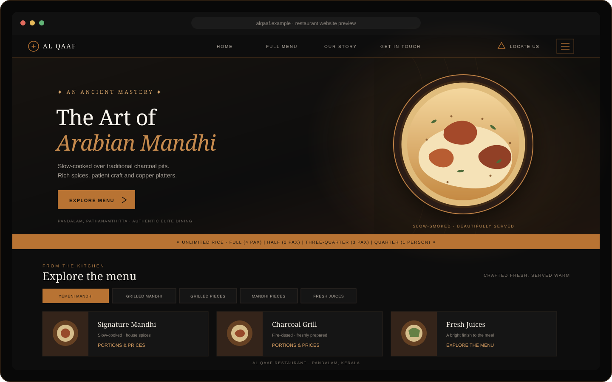
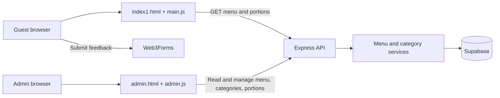

<div align="center">

<h1>Al Qaaf Restaurant</h1>

<p><strong>An editorial-style home for Arabian mandhi in Pandalam.</strong></p>

<p>Discover the menu, explore the restaurant story, and manage dishes from a
companion admin panel backed by an Express API and Supabase.</p>

<p>
  <a href="https://dexter967.github.io/mandhi/index1.html">Open the website</a> ·
  <a href="https://dexter967.github.io/mandhi/admin.html">Open the admin page</a> ·
  <a href="https://github.com/dexter967/mandhi">Browse the source</a>
</p>

</div>

<br />

## Website preview

<p align="center">
  
</p>

<p align="center"><em>A hand-drawn README illustration of the website's layout and visual direction; it is not a browser screenshot.</em></p>

> **Live preview:** the published storefront is currently at
> [`/index1.html`](https://dexter967.github.io/mandhi/index1.html). The Pages
> root URL currently shows this README because the storefront file is named
> `index1.html`, rather than `index.html`.

---

## At a glance

| Area | What it does | Main files |
| --- | --- | --- |
| Restaurant website | Presents the restaurant, menu, story, location and feedback form | `index1.html`, `style.css`, `main.js` |
| Admin page | Adds and edits menu items, categories and portion prices | `admin.html`, `admin.css`, `admin.js` |
| API | Serves menu, category and portion data and handles admin changes | `server/server.js`, `server/src/` |
| Database | Stores menu content in Supabase tables | `server/src/config/supabase.js` |
| Static publishing | Builds and deploys the repository through GitHub Pages | `.github/workflows/static.yml` |

## The experience

### Guest-facing website

- **Restaurant introduction:** a cinematic hero, editorial typography and
  copper-toned details introduce Al Qaaf and its slow-cooked mandhi.
- **Navigation:** the fixed header links to the full menu, restaurant story,
  feedback form and Google Maps directions. The brand panel also includes
  address and telephone links.
- **Menu browsing:** category tabs are generated from categories that have
  available menu items. Selecting a category smoothly scrolls to its dishes.
- **Live full-menu panel:** the header menu button uses the same current API
  data as the menu cards, including portion prices; unavailable dishes and
  the former hard-coded menu snapshot are not shown.
- **Dish details:** cards can show a description, image, optional base price
  and multiple portion prices. A fallback image is used if a dish image fails
  to load.
- **Story and feedback:** restaurant story cards and a customer feedback form
  round out the page. Feedback submission uses Web3Forms.
- **Motion and layout:** the page includes animated details, menu-card
  interactions and responsive styling for smaller screens.

### Admin page

Open `admin.html` to use the menu-management interface. It can:

- Create menu items with a name, description, category, optional price and
  image URL.
- List, edit and delete existing menu items.
- Add and remove categories.
- Add, update and delete portion options and prices for a menu item.
- Show loading, success and error messages while requests run.

The API has a category-update endpoint, although the current admin screen does
not expose a category-edit control.

## How the pieces fit together



The browser pages are plain HTML, CSS and JavaScript; no frontend bundler is
required. The Node.js API separates HTTP routes, controllers and database
services. Supabase errors are returned by the API as unsuccessful responses.

## Project structure

```text
.
├── index1.html                 # Guest-facing restaurant website
├── style.css                   # Storefront layout, responsive rules and theme
├── main.js                     # Navigation, effects and live menu rendering
├── admin.html                  # Menu-management page
├── admin.css                   # Admin styling
├── admin.js                    # Admin actions and API requests
├── server/
│   ├── server.js               # Starts the Express server
│   ├── .env.example            # Local backend configuration template
│   ├── package.json            # Backend scripts and dependencies
│   └── src/
│       ├── app.js              # Middleware and API mounting
│       ├── config/supabase.js  # Supabase client
│       ├── routes/             # Menu and category endpoint definitions
│       ├── controllers/        # HTTP request/response handlers
│       └── services/           # Supabase queries
├── docs/
│   └── website-preview.svg     # README website illustration
└── .github/workflows/
    └── static.yml             # GitHub Pages deployment workflow
```

The repository also contains `mandhi/`, a Git submodule pinned to an older
version of this project. Its `.gitmodules` entry is required so GitHub Actions
can check out the pinned commit.

## Run it locally

### Prerequisites

- Git
- Node.js 20 LTS or newer, with npm
- A Supabase project with the tables described below
- A Web3Forms access key if you want to test feedback submissions

### 1. Install and configure the API

From the repository root, run:

```powershell
cd server
npm ci
Copy-Item .env.example .env
```

Edit `server/.env` and provide your own Supabase project URL and **server-only**
service-role key, plus an admin access token:

```dotenv
SUPABASE_URL=https://your-project-ref.supabase.co
SUPABASE_SERVICE_ROLE_KEY=your-service-role-key
ADMIN_API_TOKEN=your-long-random-admin-token
CORS_ORIGINS=http://localhost:5500,http://127.0.0.1:5500
PORT=5000
```

Do not commit `.env`, publish the service-role key, or put it in browser
JavaScript. The API uses this privileged key to perform database operations.
Keep `ADMIN_API_TOKEN` private too. Generate a random token locally with:

```powershell
node -e "console.log(require('node:crypto').randomBytes(32).toString('hex'))"
```

Start the API from the `server/` directory:

```powershell
npm run dev
```

The API listens on port `5000` by default. Visit
[`http://localhost:5000/`](http://localhost:5000/) to check that the server
responds.

### 2. Serve the website pages

Serve the repository root with a local static-file server (for example, the
VS Code Live Server extension), then open:

- Storefront: `http://127.0.0.1:5500/index1.html`
- Admin: `http://127.0.0.1:5500/admin.html`

On local hostnames, both pages use `http://localhost:5000/api`. On GitHub
Pages, the API URL is generated at deploy time from the
`MANDHI_API_BASE_URL` GitHub Actions variable. If it is unset, the pages report
that the API is not configured instead of trying to connect to a visitor's
localhost.

## Supabase data requirements

The API expects these tables and fields. Create them in your Supabase project
before starting the website; this repository does not currently include
database migrations.

| Table | Fields used by the application |
| --- | --- |
| `categories` | `id`, `name`, `display_order` |
| `menu_items` | `id`, `name`, `description`, `category_name`, `price`, `image_url`, `display_order`, `is_available`, `is_bestseller`, `is_featured` |
| `menu_portions` | `id`, `menu_item_id`, `portion_name`, `price`, `display_order` |

Use a primary key for each `id` and a foreign-key relationship from
`menu_portions.menu_item_id` to `menu_items.id`. Prices may be empty when a
menu item or portion does not have a listed price. Menu items refer to their
category by `category_name`; keep this value consistent with the category
names.

## API reference

All endpoints are mounted at `http://localhost:5000/api`. Successful reads
return JSON in the form `{ "success": true, "count": 0, "data": [] }`;
mutations return a success flag, message and (when applicable) data.
Send `Authorization: Bearer <ADMIN_API_TOKEN>` with every `POST`, `PUT` and
`DELETE` request. `POST /admin/verify` checks a token before the admin page
stores it for the current tab session.

| Method | Endpoint | Purpose |
| --- | --- | --- |
| `GET` | `/menu` | List menu items |
| `POST` | `/menu` | Create a menu item |
| `PUT` | `/menu/:id` | Update a menu item |
| `DELETE` | `/menu/:id` | Delete a menu item |
| `GET` | `/menu/:id/portions` | List portions for a menu item |
| `POST` | `/menu/:id/portions` | Add a portion |
| `PUT` | `/menu/portions/:portionId` | Update a portion |
| `DELETE` | `/menu/portions/:portionId` | Delete a portion |
| `GET` | `/categories` | List categories |
| `POST` | `/categories` | Create a category |
| `PUT` | `/categories/:id` | Update a category |
| `DELETE` | `/categories/:id` | Delete a category |
| `POST` | `/admin/verify` | Verify the admin access token |

## Design and implementation

- **Palette:** near-black surfaces and warm copper accents carry the restaurant
  identity through the storefront and admin panel.
- **Typography:** the storefront declares Khodijah, Zanzabar and Arabico
  custom fonts, with serif fallbacks. The font files are not currently included
  in the repository, so browsers use their fallbacks until those assets are
  supplied.
- **Responsive presentation:** CSS media queries adapt the storefront and
  admin layout to narrow screens.
- **Vanilla frontend:** direct DOM updates and `fetch()` keep the pages
  lightweight and make the backend contract visible.
- **Backend layers:** Express routes dispatch to controllers, which call
  Supabase-backed services.
- **Static hosting:** the Pages workflow deploys static files. It does not
  host the Express API or provision a database. Menu changes are propagated
  through Supabase and appear on the storefront after it fetches the API.

## Before public production use

The API restricts browser origins and requires a private admin token for
every create, update and delete operation. Keep the token and Supabase
service-role key on the server; do not put them in frontend files. The admin
page keeps the token only in that browser tab's session. For a hardened
production deployment, also review rate limiting, input validation and
operational logging.

## Development notes

- Start the backend from `server/` with `npm run dev`; run it with
  `npm start`.
- The `server` package does not currently define an automated test suite.
- Keep generated dependencies and local environment files out of commits.
- The project is currently plain HTML/CSS/JavaScript on the frontend and
  Node.js/Express on the backend.

## Deployment

### Deploy the API to Render

The repository includes a Render Blueprint in `render.yaml`.

Keep the two kinds of configuration separate:

- **Backend secrets** (`SUPABASE_SERVICE_ROLE_KEY` and `ADMIN_API_TOKEN`) go in
  the Render service's environment. For local backend development only, put
  them in the ignored `server/.env` file. A local `.env` file is not uploaded
  to Render, and `.env.example` is public; never put either secret in it.
- **Public API address** (`MANDHI_API_BASE_URL`) goes in GitHub Actions
  **Variables**. It is an address, not a secret. GitHub Pages needs it to know
  which Render API to contact.

1. In Render, create a Blueprint and select this GitHub repository. Review
   the `mandhi-api` web service defined in the Blueprint.
2. In the Render Dashboard, open the `mandhi-api` service and select
   **Environment**. Set `SUPABASE_URL`, `SUPABASE_SERVICE_ROLE_KEY` and
   `ADMIN_API_TOKEN` there. Generate the admin token locally with the command
   above; never commit it or put it in frontend files. The Blueprint supplies
   the allowed browser origins.
3. Save the environment changes and deploy the service. Wait for the `/` health
   check to pass, then copy the service's HTTPS `onrender.com` URL.
4. In GitHub, open **Settings → Secrets and variables → Actions → Variables**
   and create `MANDHI_API_BASE_URL` with the Render URL followed by `/api`,
   for example `https://mandhi-api.onrender.com/api` (use the actual URL
   Render assigns).
5. Run the **Deploy static content to Pages** workflow from the Actions tab.
   This regenerates `api-config.js` with the deployed API URL.
6. Open the admin page, enter the same `ADMIN_API_TOKEN` you configured in
   Render, and select **Connect Admin**. The token stays in that browser tab's
   session.

Public menu and category reads do not require the token. All menu, portion and
category writes do. Until the API URL variable is configured, Pages shows an
API-not-configured message instead of requesting the visitor's localhost.

Pushing to `main` triggers the GitHub Pages deployment workflow. After a
successful run, open the storefront directly at
[`https://dexter967.github.io/mandhi/index1.html`](https://dexter967.github.io/mandhi/index1.html).
The Render API and Supabase database must also be deployed and configured as
described above.

---

<div align="center">

<p>Made for the Al Qaaf Restaurant experience in Pandalam, Kerala.</p>

</div>
